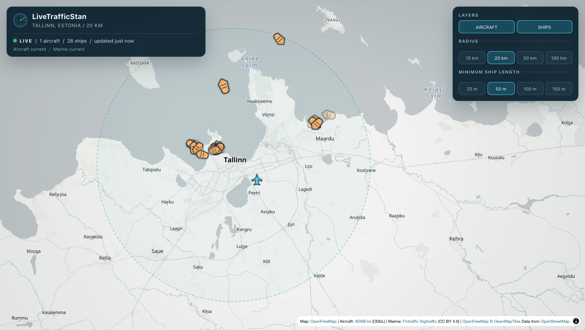

# LiveTrafficStan

LiveTrafficStan is a lightweight live map of aircraft and significant vessels
around Tallinn, Estonia. It combines open traffic data with MapLibre GL JS in a
single React application, without accounts, a database, or persistent tracking.



## Current features

- Live aircraft from [ADSB.lol](https://www.adsb.lol/) with approximately
  20-second refreshes.
- Lazily loaded selected-aircraft model, configuration, and wake-category
  context from a pinned ODC-By aircraft database, with exact identity checks,
  source age, confidence, and local failure isolation.
- Local current-aircraft search by callsign, registration, ICAO24, or reported
  type. Search ranks exact, prefix, and substring matches without changing the
  map, camera, providers, or visible marker set.
- Live marine traffic from
  [Fintraffic Digitraffic](https://www.digitraffic.fi/en/marine-traffic/) using
  REST initialization and MQTT over secure WebSockets.
- OpenStreetMap-derived vector maps from
  [OpenFreeMap](https://openfreemap.org/), rendered with MapLibre GL JS.
- Explicit Auto, Light, and Dark theme preferences. Auto follows the browser
  color-scheme signal, while Light and Dark remain persistent overrides; all
  three switch the base map without recreating MapLibre or resetting traffic.
- Viewport-driven traffic after settled pan, zoom, rotation, pitch, Home, and
  resize changes.
- A truthful 100 km enclosing-query limit: wider or unsafe views pause traffic
  and ask the user to zoom in rather than showing partial coverage as complete.
- A session Home/Center action plus privacy-safe one-shot browser location:
  already-granted permission and grants made while the page is open are used
  automatically; otherwise location is an explicit action with Tallinn
  fallback.
- One explicit-submit location field accepts rounded decimal coordinates
  locally or named places through Photon. Search failure never blocks
  coordinate navigation, Center, or the live map.
- Independent aircraft and ship layers plus local vessel search by name,
  callsign, MMSI, or IMO; typed category, navigation, reported-speed, and
  inclusive length filters; explicit unknown-value handling; and a reset to
  the released 50 metre minimum.
- An optional, lazily loaded, zoom-aware Natural Earth port context layer with
  separate selection, failure, and attribution. Port points are generalized
  and incomplete and are never treated as operational harbour or vessel-call
  data.
- An optional, lazily loaded OurAirports layer containing pinned large and
  medium airport reference points, static details, and a bounded keyboard
  list for the current view. It does not imply operational status, routes,
  arrivals, or departures.
- Optional session-only aircraft and vessel clustering, kept in separate
  MapLibre sources with distinct counts and expansion behavior. Clustering
  starts off and never changes provider request cadence or entity identity.
- An optional METAR/SPECI observation layer from the NOAA/NWS Aviation Weather
  Center. It uses explicit ICAO codes from the pinned airport projection,
  shows observation and retrieval age, expires old reports, and remains
  independent of traffic providers and static airport context.
- Honest detail cards, provider-specific health, stale/expired handling, and
  partial operation when one provider fails.
- Short interpolation only between observed positions and a bounded 15-minute
  in-memory trail for the selected object.
- Responsive floating controls, keyboard focus states, non-color status labels,
  and a small provider-reported set of original aircraft and vessel
  silhouettes with generic fallbacks.
- Touch-specific selection tolerance for isolated markers; exact mouse hits stay
  unchanged and ambiguous nearby traffic is never guessed.

## Quick start

Use Node.js 20.19 or newer and npm 10 or newer.

```bash
npm install
npm run dev
```

Open <http://localhost:5173>. The checked-in defaults work without API keys.
To change the center or provider endpoints, copy `.env.example` to `.env.local`
and edit only the values you need.

Run all local quality checks with:

```bash
npm run lint
npm run typecheck
npm test -- --run
npm run check:aircraft-metadata
npm run check:ports
npm run check:airports
npm run build
```

Test the production output and its local aircraft and METAR proxies with:

```bash
npm run preview
```

Test the production Cloudflare boundary locally with:

```bash
npm run build
npm run check:deploy
npm run preview:worker
```

## Architecture

Provider-specific code validates and normalizes external payloads before React
or MapLibre sees them:

```text
ADSB.lol polling ───────┐
                       ├─> normalized traffic -> freshness/history -> map + UI
Digitraffic REST/MQTT ──┘

selected aircraft -> static metadata index + one prefix shard -> details only

PORTS toggle -> pinned same-origin Natural Earth projection -> map + port details
AIRPORTS toggle -> pinned same-origin OurAirports projection -> map + airport details
METAR toggle -> qualifying airport ICAO codes -> same-origin AWC proxy
             -> current observations -> map + weather details

current aircraft -> local literal search -> existing traffic selection

coordinate input ── local validation ─┐
Photon forward search ─> place results ├─> explicit camera navigation
session Home / location ──────────────┘
```

The application keeps one MapLibre instance and updates persistent GeoJSON
sources and layers. Marine MQTT messages are merged and emitted at most once
per second. Aircraft polling and marine connections pause while the document is hidden or
the visible map cannot be covered by the bounded query. Their session-lived
cadence, backoff, reconnect, REST, metadata, and cache state survives the pause.

The application derives a safely unwrapped full-canvas footprint from MapLibre
after settled camera changes. Providers receive its conservative enclosing
circle, while normalized aircraft and vessels are filtered to the actual
viewport polygon before display. Floating controls do not shrink the geographic
query area.

Resolved Light/Dark changes, including Auto system changes, use `map.setStyle`
on that same MapLibre instance. An
idempotent installer restores traffic images, sources, layers, current data,
visibility, and trail after each style load while preserving camera,
selection, provider state, and connections.

Aircraft metadata is a separate selected-object boundary. It makes no startup
request, loads one immutable index and one ICAO24-prefix shard on first use,
validates the complete assets before bounded caching, and never mutates live
traffic or marker categories.

Vessel discovery is local display filtering after provider freshness and exact
viewport filtering. It does not alter Digitraffic subscriptions, REST gates,
provider caches, or source snapshots. The optional port dataset is another
independent same-origin boundary: it makes no request until enabled, validates
the complete immutable asset before caching, and remains separate from traffic
IDs, counts, trails, selection, and provider health.

Aircraft discovery searches only the current non-expired viewport aircraft
already held by the application. The optional airport dataset follows the same
independent static-context boundary as ports, but keeps large and medium airport
points visible at higher zooms and exposes static provenance rather than
operational flight information.

The optional METAR boundary reuses explicit four-letter ICAO codes from the
pinned airport dataset; it never infers stations from traffic or movement.
There is no startup weather request and no periodic poller. First enable,
settled station-set changes, explicit refresh, and retry share one session
request-start gate of at least 60 seconds. Reports become stale after 75
minutes and expire after 120 minutes. Hiding the layer preserves a fulfilled
same-view result without persisting it.

See [Architecture](docs/architecture.md) for component boundaries, data flow,
failure isolation, rendering, and deployment details.

## Configuration

The defaults are centralized and validated in
[`src/config/appConfig.ts`](src/config/appConfig.ts). Browser-safe overrides are
available for:

| Variable | Default |
| --- | --- |
| `VITE_CENTER_LATITUDE` | `59.437` |
| `VITE_CENTER_LONGITUDE` | `24.7536` |
| `VITE_CENTER_LABEL` | `Tallinn, Estonia` |
| `VITE_MAP_STYLE_URL` | `https://tiles.openfreemap.org/styles/positron` |
| `VITE_MAP_DARK_STYLE_URL` | `https://tiles.openfreemap.org/styles/dark` |
| `VITE_GEOCODER_ENDPOINT` | `https://photon.komoot.io/api` |
| `VITE_AIRCRAFT_ENDPOINT` | `/api/aircraft` |
| `VITE_WEATHER_ENDPOINT` | `/api/weather/metar` |
| `VITE_MARINE_REST_ENDPOINT` | `https://meri.digitraffic.fi` |
| `VITE_MARINE_MQTT_ENDPOINT` | `wss://meri.digitraffic.fi:443/mqtt` |

These variables are embedded in the client bundle and must never contain
secrets. See [Configuration](docs/configuration.md) for validation rules,
operational thresholds, and examples.

## Data providers and licensing

| Purpose | Provider | Runtime data license | V1 access |
| --- | --- | --- | --- |
| Map | OpenFreeMap / OpenMapTiles / OpenStreetMap | Provider and OSM attribution applies | Direct browser access |
| Place search | Photon / OpenStreetMap | OSM ODbL attribution applies | Direct browser access on explicit submit |
| Aircraft | ADSB.lol | ODbL 1.0 | Same-origin Vite or Cloudflare Worker proxy |
| Aircraft metadata | Mictronics aircraft-database derivative | ODC-By 1.0 | Immutable same-origin static assets, loaded only after selection |
| Marine | Fintraffic Digitraffic | CC BY 4.0 | Direct regional REST and MQTT |
| Port context | Natural Earth Ports | Public domain | Immutable same-origin static asset, loaded only when enabled |
| Airport context | OurAirports | Public domain | Immutable same-origin static asset, loaded only when enabled |
| Weather observations | NOAA/NWS Aviation Weather Center | U.S. public domain unless marked otherwise | Strict same-origin Worker/Vite route, loaded only when METAR is enabled |

The repository's Apache License 2.0 applies to source code only. The bundled
aircraft metadata is a derivative database conveyed under ODC-By 1.0 with its
full license alongside the generated files. Distributed derivative works must
preserve the applicable [`NOTICE`](NOTICE) and data-license attribution. The
source license does not relicense map, search, live aircraft, aircraft
metadata, marine data, or the separately identified public-domain Natural
Earth port and OurAirports projections. See
[Data Sources and Licensing](docs/data-sources-and-licensing.md), the dated
[Aircraft Provider Evaluation](docs/aircraft-provider-evaluation.md), and the
dated [Aircraft Metadata Evaluation](docs/aircraft-metadata-evaluation.md), the
dated [Marine Provider Evaluation](docs/marine-provider-evaluation.md), and the
[Airport Board Evaluation](docs/airport-board-evaluation.md) for verified
contracts, official links, measured/request-volume evidence, and unresolved
authorization gates.

## Deployment

Cloudflare Workers with Static Assets is the selected production boundary. It
deploys the Vite client with strict same-origin ADSB.lol point and AWC METAR
routes as one atomic unit. Hashed assets, including the MapLibre worker, use
immutable browser caching; live aircraft responses use no shared cache and
successful METAR responses receive only the source-aligned 60-second cache
guidance.

The proxy accepts only
`GET /api/aircraft/v2/point/{latitude}/{longitude}/{radiusNm}`, validates the
current 1-54 NM transport contract, uses a total upstream deadline and body
limit, rejects redirects, and preserves provider status, body, and
`Retry-After`. It forwards no browser credentials or arbitrary headers and
keeps request URL logging disabled.

The weather route accepts only
`GET /api/weather/metar?ids=EETN%2CEFHK`, with 1-50 sorted unique uppercase
four-letter IDs and no other parameters. It constructs one fixed AWC JSON
request, follows no redirects, forwards no browser credentials, uses an
eight-second deadline and 256 KiB response cap, and preserves `Retry-After`.

The deploy-ready code is not yet a claimed public deployment. Permanent
Cloudflare account authorization and environment credentials are tracked in
[Issue #39](https://github.com/vasilyevstan/LiveTrafficStan/issues/39).
See [Hosting and Deployment](docs/hosting-and-deployment.md) for the dated
platform matrix, request budget, proxy contract, exact-SHA workflow, smoke,
monitoring, privacy, and rollback procedure.

## Known limitations

- Public providers offer no application SLA, and live traffic coverage varies
  by receiver availability and time.
- The default aircraft endpoint works through Vite development and preview;
  public Cloudflare activation remains blocked on Issue #39.
- Digitraffic is a regional source with an unknown exact coverage boundary.
  Its all-published-vessels MQTT stream is filtered in the browser; this local
  filtering does not reduce incoming MQTT bandwidth.
- Views whose conservative enclosing radius exceeds 100 km pause live traffic
  until the user zooms in or reduces tilt. Partial coverage is never presented
  as complete.
- Trails disappear on refresh and are intentionally limited to the selected
  object.
- Browser location is one-shot, rounded, and session-only; it is not continuous
  tracking and exact coordinates are not persisted.
- Named place text is sent to Photon only after explicit submission. Photon is
  a fair-use public service with no availability guarantee; direct coordinate
  entry remains local and available during search failure or throttling.
- Aircraft metadata is available only for an exact, non-conflicting selected
  ICAO24 record in the pinned snapshot. The snapshot becomes intentionally
  unavailable after its 45-day publication-age boundary until a reviewed new
  immutable version is deployed.
- Natural Earth ports are optional generalized geographic context, not a
  complete port inventory. Some source points may be approximate by up to
  20 miles, and the app does not infer facilities, berths, operational status,
  port calls, nearby-vessel relationships, destinations, or ETAs.
- OurAirports points are optional static reference context. The source
  disclaims accuracy and fitness, and the app does not infer current service,
  airport operations, aircraft relationships, routes, arrivals, or departures.
- Current arrival and departure boards remain blocked on an authorized
  airport/time-window provider contract in
  [Issue #46](https://github.com/vasilyevstan/LiveTrafficStan/issues/46).
- Auto follows the browser's color-scheme preference, not solar time or map
  location.
- METAR coverage is limited by both AWC reporting and the pinned large/medium
  airport projection. It is observed aviation weather, not a forecast,
  airport board, operational status, or global coverage guarantee. Enabling it
  sends visible qualifying ICAO station IDs through the application host to
  AWC.
- There is no reverse geocoding, route enrichment, playback, radar,
  precipitation forecast, account, saved center preference, or offline mode.

Planned work is tracked in
[GitHub Issues](https://github.com/vasilyevstan/LiveTrafficStan/issues), not
silently expanded into V1.

## Project documentation

- [Architecture](docs/architecture.md)
- [Configuration](docs/configuration.md)
- [Data Sources and Licensing](docs/data-sources-and-licensing.md)
- [Aircraft Provider Evaluation](docs/aircraft-provider-evaluation.md)
- [Aircraft Metadata Evaluation](docs/aircraft-metadata-evaluation.md)
- [Airport Board Evaluation](docs/airport-board-evaluation.md)
- [Marine Provider Evaluation](docs/marine-provider-evaluation.md)
- [Hosting and Deployment](docs/hosting-and-deployment.md)
- [Development and Testing](docs/development-and-testing.md)
- [Troubleshooting](docs/troubleshooting.md)
- [Engineering Decisions](docs/decisions.md)
- [GitHub Wiki](https://github.com/vasilyevstan/LiveTrafficStan/wiki)

## License

LiveTrafficStan source code is available under the
[Apache License 2.0](LICENSE). Redistributions and derivative works must retain
the applicable license, copyright, and [`NOTICE`](NOTICE) attribution. This
keeps the project open for permissive personal and commercial use while
preserving credit to the original project and author.
