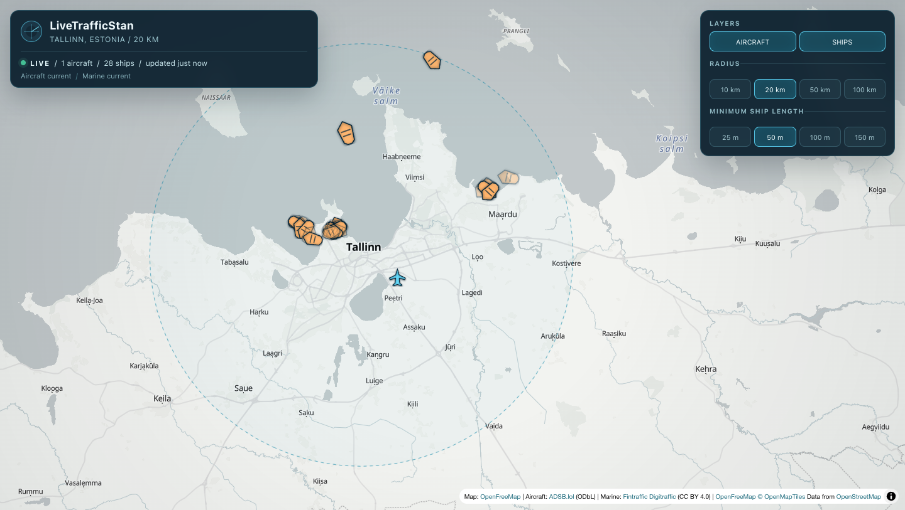

# LiveTrafficStan

LiveTrafficStan is a lightweight live map of aircraft and significant vessels
around Tallinn, Estonia. It combines open traffic data with MapLibre GL JS in a
single React application, without accounts, a database, or persistent tracking.

Public production: <https://livetrafficstan.syntal.workers.dev>



## Current features

- Live aircraft from [ADSB.lol](https://www.adsb.lol/) with approximately
  20-second refreshes.
- Lazily loaded selected-aircraft model, configuration, and wake-category
  context from a pinned ODC-By aircraft database, with exact identity checks,
  source age, confidence, and local failure isolation.
- Offline selected-detail country context: aircraft registration allocation
  from vetted ICAO24 ranges and vessel flag state from valid ordinary MMSIs.
  Unknown, special-purpose, conflicting, and malformed identifiers are omitted
  rather than guessed.
- Local current-aircraft search by callsign, registration, ICAO24, or reported
  type. Search ranks exact, prefix, and substring matches without changing the
  map, camera, providers, or visible marker set.
- Live marine traffic from
  [Fintraffic Digitraffic](https://www.digitraffic.fi/en/marine-traffic/) using
  REST initialization and MQTT over secure WebSockets.
- OpenStreetMap-derived vector maps from
  [OpenFreeMap](https://openfreemap.org/), rendered with MapLibre GL JS.
- Explicit Auto, Light, and Dark theme preferences. Auto follows the browser
  color-scheme signal, while Light and Dark remain persistent overrides; all
  three switch the base map without recreating MapLibre or resetting traffic.
- One versioned device-local preference schema remembers theme, metric or
  aviation/nautical presentation units, layers, structured vessel filters, and
  selected-trail controls. It never stores camera, Home/location, search text,
  selection, provider state, playback, or private-history consent.
- An explicit **Share view** action creates a fragment-only link containing a
  three-decimal camera plus validated presentation state. Opening it does not
  save those overrides, and its camera wins over a later automatic geolocation
  result.
- Viewport-driven traffic after settled pan, zoom, rotation, pitch, Home, and
  resize changes.
- A truthful 100 km enclosing-query limit: wider or unsafe views pause traffic
  and ask the user to zoom in rather than showing partial coverage as complete.
- A session Home/Center action plus privacy-safe one-shot browser location:
  already-granted permission and grants made while the page is open are used
  automatically; otherwise location is an explicit action with Tallinn
  fallback.
- One explicit-submit location field accepts rounded decimal coordinates
  locally or named places through Photon. Search failure never blocks
  coordinate navigation, Center, or the live map.
- Independent aircraft and ship layers plus local vessel search by name,
  callsign, MMSI, or IMO; typed category, navigation, reported-speed, and
  inclusive length filters; explicit unknown-value handling; and a reset to
  the released 50 metre minimum. Selected ship speed is shown in both km/h and
  knots. Fresh sailing vessels and pleasure craft at least 8 metres long and
  moving at least 1 knot receive dedicated yacht icons.
- An optional, lazily loaded, zoom-aware Natural Earth port context layer with
  separate selection, failure, and attribution. Port points are generalized
  and incomplete and are never treated as operational harbour or vessel-call
  data.
- An optional, lazily loaded OurAirports layer containing pinned large and
  medium airport reference points, static details, and a bounded keyboard
  list for the current view. It does not imply operational status, routes,
  arrivals, or departures.
- Optional remembered aircraft and vessel clustering, kept in separate
  MapLibre sources with distinct counts and expansion behavior. Clustering
  starts off and never changes provider request cadence or entity identity.
- An optional METAR/SPECI observation layer from the NOAA/NWS Aviation Weather
  Center. It uses explicit ICAO codes from the pinned airport projection,
  shows observation and retrieval age, expires old reports, and remains
  independent of traffic providers and static airport context.
- A default-off modeled orbital layer for CelesTrak's bounded `visual`
  catalog. It propagates current satellite and cataloged rocket-body
  subpoints locally with SGP4, identifies ground tracks that cross a safe local
  map view within 90 minutes, and draws one bounded selected-object track.
  **ORBITS** stays beside **AIRCRAFT** and **SHIPS** in the primary Operations
  row; its compact modeled-state summary is also mirrored in the upper-left
  status panel without changing aircraft/marine health.
  Exact SATCAT type, element epoch, snapshot age, and limitations remain
  visible; these are modeled positions, not live telemetry or optical
  visibility predictions. Exact NORAD `20580` (Hubble) and `25544` (ISS) also
  have a reviewed bundled NASA purpose and historical photograph. Other
  objects state that enrichment is unavailable rather than receiving an
  inferred mission or generic picture. Hover uses bundled text only; a
  selected image uses one bounded same-origin load whose media type, byte
  count, and SHA-256 are validated before a session Blob URL can appear in
  details or a later tooltip.
- A default-enabled ADSB.lol plausible-route lookup for a selected live
  aircraft. A committed selection starts one lookup and shows a compact result
  directly below the aircraft heading. Hover, HISTORY, and same-flight position
  updates stay passive. It validates one exact normalized callsign plus current
  position against standing-data route segments and never claims a filed plan,
  schedule, or operational status. Successful exact-identity results are
  reused from a bounded six-hour in-memory tab cache; provider `Retry-After` or
  a bounded local cooldown prevents repeated failures without automatic retry.
- A production-enabled Planespotters aircraft-photo path. It accepts only an
  exact ICAO24 hex lookup after **Load aircraft photo** or one stable 500 ms
  fine-pointer hover, preserves the returned thumbnail and photo-page URLs,
  shows visible photographer credit, keeps bounded JSON only in current-tab
  memory, and publishes a completed hover result into already-open matching
  selected details without a second provider request.
- Five bundled historical vessel reference photos for Finlandia, Victoria I,
  Viking XPRS, Megastar, and MyStar. A photo appears only in selected live
  ship details or after a stable fine-pointer hover when the AIS-reported IMO
  is valid and exactly matches the reviewed manifest; visible author, fixed
  Commons revision, license, and modification attribution are retained without
  any runtime image-provider request.
- Honest detail cards, provider-specific health, stale/expired handling, and
  partial operation when one provider fails.
- Short interpolation only between observed positions and a selected-object
  in-memory trail configurable to 5, 15, 30, or 60 minutes. Trail visibility
  and duration are remembered, while the provider observations remain
  session-only unless private local history is explicitly enabled.
- Always-on bounded session observation history plus optional private
  origin-local IndexedDB history. Durable recording is off by default, uses
  1/6/24-hour retention choices, and can be cleared or disabled and deleted.
- Explicit historical playback with a frozen range, scrub, play/pause,
  0.5×/1×/2×/4× speed, gap-aware selected trails, and one-action return to
  live. Playback changes display time only; eligible live acquisition
  continues in the background.
- An installable dependency-free application shell. The generated service
  worker caches only the exact HTML, hashed application assets, manifest,
  favicon, and versioned icons; it never caches live APIs, MQTT, map resources,
  search, weather, static context datasets, or private history.
- Truthful cold-offline startup after installation. Live acquisition is marked
  unavailable, external basemap tiles are not promised, and a bundled
  source-free background lets retained IndexedDB traffic and trails render in
  explicit HISTORY mode.
- Non-blocking application updates with an explicit **Refresh app** action,
  bounded current/predecessor shell caches, and a tested retirement build that
  removes only application-shell caches without deleting preferences or private
  history.
- Responsive Operations and Location & Settings controls with one scroll owner
  per disclosure, session-only Layers/Find/Context/Orbits/Sources views,
  visual-viewport-aware mobile sizing, keyboard focus states, non-color
  status/detail labels, compact provider/privacy copy, and a small
  provider-reported set of original aircraft and vessel silhouettes with
  generic fallbacks. The duplicate traffic legend is intentionally omitted.
- Touch-specific selection tolerance for isolated markers; exact mouse hits stay
  unchanged and ambiguous nearby traffic is never guessed.

## Quick start

Use Node.js 24 or newer and npm 10 or newer.

```bash
npm install
npm run dev
```

Open <http://localhost:5173>. The checked-in defaults work without API keys.
To change the center or provider endpoints, copy `.env.example` to `.env.local`
and edit only the values you need.

Run all local quality checks with:

```bash
npm run lint
npm run typecheck
npm test -- --run
npm run check:aircraft-metadata
npm run check:country-allocations
npm run check:vessel-photos
npm run check:orbital-catalog
npm run check:orbital-enrichment
npm run check:ports
npm run check:airports
npm run build
```

Test the production output and its local aircraft and METAR proxies with:

```bash
npm run preview
```

Test the production Cloudflare boundary locally with:

```bash
npm run build
npm run check:deploy
npm run preview:worker
```

To exercise the enabled orbital bootstrap route for local rendered acceptance:

```bash
npm run build
npx wrangler dev --local --var ORBITAL_CATALOG_ENABLED:true
```

## Architecture

Provider-specific code validates and normalizes external payloads before React
or MapLibre sees them:

```text
ADSB.lol polling ───────┐
                       ├─> normalized traffic -> live display + bounded session history
Digitraffic REST/MQTT ──┘                         |
                                                  ├─> optional private IndexedDB
                                                  └─> historical index/playback -> map + UI

selected aircraft -> static metadata index + one prefix shard -> details only
selected/hovered live vessel -> exact valid IMO -> bundled reviewed photo
                              -> details or stable-hover tooltip

PORTS toggle -> pinned same-origin Natural Earth projection -> map + port details
AIRPORTS toggle -> pinned same-origin OurAirports projection -> map + airport details
METAR toggle -> qualifying airport ICAO codes -> same-origin AWC proxy
             -> current observations -> map + weather details

ORBITS toggle -> same-origin complete CelesTrak snapshot -> dedicated SGP4 worker
              -> modeled points + local crossing results + selected track

current aircraft -> local literal search -> existing traffic selection

coordinate input ── local validation ─┐
Photon forward search ─> place results ├─> explicit camera navigation
session Home / location ──────────────┘
```

The application keeps one MapLibre instance and updates persistent GeoJSON
sources and layers. Marine MQTT messages are merged and emitted at most once
per second. Aircraft polling and marine connections pause while the document is hidden or
the visible map cannot be covered by the bounded query. Their session-lived
cadence, backoff, reconnect, REST, metadata, and cache state survives the pause.

The application derives a safely unwrapped full-canvas footprint from MapLibre
after settled camera changes. Providers receive its conservative enclosing
circle, while normalized aircraft and vessels are filtered to the actual
viewport polygon before display. Floating controls do not shrink the geographic
query area.

Resolved Light/Dark changes, including Auto system changes, use `map.setStyle`
on that same MapLibre instance. An
idempotent installer restores traffic images, sources, layers, current data,
visibility, and trail after each style load while preserving camera,
selection, provider state, and connections.

Orbital tracking is a separate modeled-data boundary. Explicit enable loads
one strictly validated same-origin snapshot, anchors modeled time to the
response clock, and creates a dedicated propagation worker. Camera and
selection changes run only local prediction work. Orbital points, crossing
results, and selected tracks remain outside traffic models, clustering,
freshness, trails, metadata, photos, and history. Wide views can therefore
show orbital objects while aircraft and ships pause under their unchanged
100 km eligibility contract.

Aircraft metadata is a separate selected-object boundary. It makes no startup
request, loads one immutable index and one ICAO24-prefix shard on first use,
validates the complete assets before bounded caching, and never mutates live
traffic or marker categories.

Vessel reference photos are a smaller synchronous presentation boundary. They
use only a valid exact AIS-reported IMO and a committed file-by-file manifest.
The image bytes are versioned same-origin assets, excluded from the
service-worker shell, and may load only for selected details or after the
existing 500 ms stable fine-pointer hover. Sub-dwell hover, search, unmatched
vessels, and HISTORY remain photo-free.

Vessel discovery is local display filtering after provider freshness and exact
viewport filtering. It does not alter Digitraffic subscriptions, REST gates,
provider caches, or source snapshots. The optional port dataset is another
independent same-origin boundary: it makes no request until enabled, validates
the complete immutable asset before caching, and remains separate from traffic
IDs, counts, trails, selection, and provider health.

Aircraft discovery searches only the current non-expired viewport aircraft
already held by the application. The optional airport dataset follows the same
independent static-context boundary as ports, but keeps large and medium airport
points visible at higher zooms and exposes static provenance rather than
operational flight information.

The optional METAR boundary reuses explicit four-letter ICAO codes from the
pinned airport dataset; it never infers stations from traffic or movement.
There is no startup weather request and no periodic poller. First enable,
settled station-set changes, explicit refresh, and retry share one session
request-start gate of at least 60 seconds. Reports become stale after 75
minutes and expire after 120 minutes. Hiding the layer preserves a fulfilled
same-view result without persisting it.

Presentation preferences are stored under
`livetrafficstan.preferences.v1`. The legacy theme key is imported only when
the unified key is absent and remains a rollback compatibility mirror. Shared
state uses a validated `#v=1&...` fragment with explicit user action; it is not
sent in HTTP requests, but users should still treat browser history and the
clipboard as places where a copied rounded view can remain visible. Metric
values remain canonical for providers, filters, history, and viewport logic;
aviation/nautical units are formatting only.

Traffic history stores only allowlisted normalized provider observations.
Session history is always volatile and bounded. Private IndexedDB recording is
explicit opt-in and bounded by retention time, record count, and logical bytes.
Clear and Disable use an authorization epoch so queued or stale-tab writes
cannot restore deleted observations. Pending batches retain their enqueue
epoch, destructive cross-tab invalidations clear the affected volatile queue,
and failed writes remain queued behind an explicit visible suspension rather
than being reported as saved. Historical mode reuses the normal search, filter,
selection, clustering, and details paths, but disables interpolation and hides
current-only aircraft metadata and METAR context.

`npm run build` generates `/sw.js` from the exact Vite output and worker policy,
and rejects an application shell above 4 MiB uncompressed. Root navigation is
network-first with cached `index.html` only as the offline fallback. Exact shell
assets are cache-first across the current and immediate predecessor generations
so an older controlled tab can finish a deferred hashed import during an
update. Every other request keeps ordinary network behavior and receives no
generic HTML fallback.

The local source-free MapLibre fallback contains only a theme-aware background.
It is installed into the existing map when the configured external style cannot
load and is replaced in that same map after reconnect. It does not imitate or
cache OpenFreeMap land, water, labels, tiles, glyphs, or sprites.

See [Architecture](docs/architecture.md) for component boundaries, data flow,
failure isolation, rendering, and deployment details.

## Configuration

The defaults are centralized and validated in
[`src/config/appConfig.ts`](src/config/appConfig.ts). Browser-safe overrides are
available for:

| Variable | Default |
| --- | --- |
| `VITE_CENTER_LATITUDE` | `59.437` |
| `VITE_CENTER_LONGITUDE` | `24.7536` |
| `VITE_CENTER_LABEL` | `Tallinn, Estonia` |
| `VITE_MAP_STYLE_URL` | `https://tiles.openfreemap.org/styles/positron` |
| `VITE_MAP_DARK_STYLE_URL` | `https://tiles.openfreemap.org/styles/dark` |
| `VITE_GEOCODER_ENDPOINT` | `https://photon.komoot.io/api` |
| `VITE_AIRCRAFT_ENDPOINT` | `/api/aircraft` |
| `VITE_AIRCRAFT_PHOTO_ENABLED` | `false` |
| `VITE_FLIGHT_ROUTE_ENABLED` | `true` |
| `VITE_WEATHER_ENDPOINT` | `/api/weather/metar` |
| `VITE_MARINE_REST_ENDPOINT` | `https://meri.digitraffic.fi` |
| `VITE_MARINE_MQTT_ENDPOINT` | `wss://meri.digitraffic.fi:443/mqtt` |

These variables are embedded in the client bundle and must never contain
secrets. See [Configuration](docs/configuration.md) for validation rules,
operational thresholds, and examples.

## Data providers and licensing

| Purpose | Provider | Runtime data license | V1 access |
| --- | --- | --- | --- |
| Map | OpenFreeMap / OpenMapTiles / OpenStreetMap | Provider and OSM attribution applies | Direct browser access |
| Place search | Photon / OpenStreetMap | OSM ODbL attribution applies | Direct browser access on explicit submit |
| Aircraft | ADSB.lol | ODbL 1.0 | Same-origin Vite/Cloudflare proxy by default; protected direct-browser build only after provider-approved CORS |
| Aircraft metadata | Mictronics aircraft-database derivative | ODC-By 1.0 | Immutable same-origin static assets, loaded only after selection |
| Selected-aircraft photos | Planespotters Photo API | API-specific and general terms apply | Explicit direct browser request and direct unchanged returned thumbnail; enabled in production |
| Selected-vessel reference photos | Reviewed Wikimedia Commons files | File-specific CC BY-SA 3.0, CC BY-SA 4.0, or CC0 1.0 | Bundled immutable same-origin assets selected only by exact valid IMO |
| Country allocations | michaeljfazio/MIDs, ibosoftnet ICAO24 transcription, Wikidata cross-check | Apache-2.0 and CC0 1.0 | Bundled deterministic local lookup |
| Marine | Fintraffic Digitraffic | CC BY 4.0 | Direct regional REST and MQTT |
| Port context | Natural Earth Ports | Public domain | Immutable same-origin static asset, loaded only when enabled |
| Airport context | OurAirports | Public domain | Immutable same-origin static asset, loaded only when enabled |
| Weather observations | NOAA/NWS Aviation Weather Center | U.S. public domain unless marked otherwise | Strict same-origin Worker/Vite route, loaded only when METAR is enabled |
| Selected-aircraft plausible route | ADSB.lol / VRS Standing Data | ADSB.lol ODbL 1.0; underlying standing data CC0 1.0 | One direct browser request on committed live selection; enabled by default |

The repository's Apache License 2.0 applies to source code only. The bundled
aircraft metadata is a derivative database conveyed under ODC-By 1.0 with its
full license alongside the generated files. Distributed derivative works must
preserve the applicable [`NOTICE`](NOTICE) and data-license attribution. The
source license does not relicense map, search, live aircraft, aircraft
metadata, marine data, vessel photographs, country-allocation projections, or
the separately identified public-domain Natural Earth port and OurAirports
projections. See
[Data Sources and Licensing](docs/data-sources-and-licensing.md), the dated
[Aircraft Provider Evaluation](docs/aircraft-provider-evaluation.md), and the
dated [Aircraft Metadata Evaluation](docs/aircraft-metadata-evaluation.md), the
dated [Aircraft Photo Evaluation](docs/aircraft-photo-evaluation.md), the
dated [Vessel Reference Photo Evaluation](docs/vessel-photo-evaluation.md), the
dated [Marine Provider Evaluation](docs/marine-provider-evaluation.md), and the
[Airport Board Evaluation](docs/airport-board-evaluation.md) for verified
contracts, official links, measured/request-volume evidence, and unresolved
authorization gates.

## Deployment

Cloudflare Workers with Static Assets is the selected production boundary. It
deploys the Vite client with strict same-origin ADSB.lol point and AWC METAR
paths as one atomic unit. Plausible route lookup is a credential-free direct
browser request to ADSB.lol standing data, so it needs no Worker route, secret,
quota service, or Durable Object. Hashed assets, including the MapLibre worker,
use immutable browser caching; live aircraft responses use no shared cache and
successful METAR responses receive only the source-aligned 60-second cache
guidance.

The protected workflow records one fixed `aircraft_delivery` choice:

- `worker-proxy` uses the same-origin Worker with shared Cloudflare egress;
- `oci-private-relay` uses the same browser route but sends only its validated
  request through the bound VPC Service, private Tunnel, and loopback OCI
  relay;
- `adsb-lol-direct` builds the browser with
  `VITE_AIRCRAFT_ENDPOINT=https://api.adsb.lol`.

The private mode requires the fixed checked VPC Service and a protected
Worker-to-relay bearer secret. Missing or invalid private configuration fails
closed with `503 Retry-After`; it never falls back to shared Cloudflare egress.
Direct mode must not be deployed until ADSB.lol explicitly approves browser
production use and the deployed API returns browser-readable CORS on both
success and throttling responses. None of these modes is a browser-controlled
provider selector.

The proxy accepts only
`GET /api/aircraft/v2/point/{latitude}/{longitude}/{radiusNm}`, validates the
current 1-54 NM transport contract, uses a total upstream deadline and body
limit, rejects redirects, and preserves provider status, body, and
`Retry-After`. It forwards no browser credentials or arbitrary headers and
keeps request URL logging disabled.

Reliable aircraft recovery uses a private
Cloudflare Worker -> Workers VPC Service -> Cloudflare Tunnel -> isolated OCI
E2 Micro relay path. The relay is fixed to ADSB.lol, globally limits upstream
starts to one per 20 seconds, persists only provider admission state, and has
no cache, generic proxy surface, public ingress, or sensitive application
logging. The Tunnel connector uses pinned `cloudflared`, IPv6 QUIC, and a
token file readable only by its dedicated service account. See
[OCI Aircraft Relay](docs/oci-aircraft-relay.md).

The weather route accepts only
`GET /api/weather/metar?ids=EETN%2CEFHK`, with 1-50 sorted unique uppercase
four-letter IDs and no other parameters. It constructs one fixed AWC JSON
request, follows no redirects, forwards no browser credentials, uses an
eight-second deadline and 256 KiB response cap, and preserves `Retry-After`.

The plausible-route path starts once when a new eligible live aircraft is
selected. It constructs one validated ADSB.lol standing-data URL from the
normalized callsign, omits credentials, rejects redirects, enforces a
ten-second deadline and 32 KiB response cap, and accepts only a route whose
airport segments fit the aircraft's current position. Same-flight position
updates do not repeat the request. Successful routes may be reused from the
current tab's 32-entry cache for up to six hours; there is no shared or
persistent route cache.

Public production is live at
<https://livetrafficstan.syntal.workers.dev> on Cloudflare Workers Free with
Static Assets. The current application source is
`bb9829bd0bb59c819b936777fe4e2cdfe32239a3`. Real-mobile Operations deployment
run `36619533493` passed exact-source deployment and full production smoke and
published Cloudflare version `49c704b3-47ec-47b4-b30b-9483dbd35564` with
client asset `assets/index-On-Ohfl9.js`. The deployment preserves:

- `oci-private-relay`, aircraft photos, and plausible routes enabled;
- the orbital catalog enabled with Cron `17 */2 * * *`;
- KV namespace `59178d55418247c4bab473b52a5dc07d`;
- a validated 156-record schema-v1 catalog with digest
  `f6183329084286f4fbb5cdfcea16e827e751569e7d5919d9e8222eadf95f017d`
  and retrieval time `2026-09-29T18:52:12.000Z`;
- deployed `index.html` SHA-256
  `2f8f4204640c6f2a05cd316cbf175fd95733ea41dfea5f89ce79e6060f4bdd82`.

Fresh rendered production acceptance used a deterministic 24-object crossing
fixture and exposed all 20 bounded results at both 390x844 and 390x568.
Operations More was the single scroll owner; touch, wheel, Page Down, and 38
Tab steps reached the final result with no nested orbital-list overflow. The
stacks measured 489.515625 px against 489.52 px and 329.4375 px against
329.44 px. One catalog request, zero browser CelesTrak requests, one unchanged
MapLibre canvas, compact deduplicated attribution, and zero console/runtime
errors were retained. The compact unavailable-route and aircraft-photo cards
also retained the required standing-data, provider/privacy, cache, and rights
wording.

A later real-device report showed that the first evidence was incomplete: it
varied the layout viewport but did not force a shorter visual viewport below
mobile browser chrome, and its geometry-only final-result check could not
detect a sticky task selector covering the result. The deployed corrective
acceptance tracks a forced 517 px visual viewport beneath an 844 px layout
viewport, keeps the controls at 299.859375 px against the 299.86 px budget,
and verifies the final result with hit testing as well as bounds. The normal
390x844,
390x568, and 315x517-class runs expose all 20 results, keep task labels
unclipped, and retain one scroll owner, one canvas, one catalog request, and
zero browser CelesTrak requests or runtime errors. Physical iOS Safari and
Android Chrome evidence remains separate and must not be inferred from CDP.

Orbital publication recovery source
`7899c99212f01bb56489033fc9cd442178df7ea0` deployed in run `36616140867`
with the stable project identity, independent coordinator schema, reviewed
`v2` coordinator, and the current fresh bootstrap. The public route for this
release still returned `X-LiveTrafficStan-Orbital-Source: bootstrap` at
`2026-09-29T19:30Z`; the first successful scheduled KV publication remains
open in #162.

The comprehensive public Wiki synchronization is commit
`c67b33036d63c095e3aadc5d19e492d3aeb53665`; it updates
[Orbital Tracking](https://github.com/vasilyevstan/LiveTrafficStan/wiki/Orbital-Tracking)
and
[Infrastructure and Hosting](https://github.com/vasilyevstan/LiveTrafficStan/wiki/Infrastructure-and-Hosting)
plus the related Home, map, release, troubleshooting, and accessibility pages
with the visual-viewport correction, task-based Operations layout,
single-scroll contract, rendered evidence, and current production identity.

The compatible aircraft relay remains at
`1f9a2fd322f141fe761d3bf00113e1ab60526e6c` and retains
`76540a21291878b44e7f92ceecb37d03a366c0c7` as its prior rollback release.

Fresh-profile rendered orbital acceptance proved zero catalog requests before
enable in the baseline lifecycle, one same-origin request after enable, zero
browser requests to CelesTrak, one unchanged MapLibre canvas, exact A-to-B-to-A
selection, theme/hide/show restoration, 156 visibly rendered whole-world
modeled objects while aircraft and ships paused, 390x844 and 390x568 panels
within the 58vh budget, real touch camera movement, and no orbital runtime
exception or main-thread task over 50 ms. A verified isolated post-release run
after the earlier crossing had passed showed
**ORBITS · 0 IN VIEW · 0 PASSES ≤90M**; **VIEW** opened the disclosure and
focused the ORBITS toggle because the current result list was empty.
Deterministic tests and the clean local production build separately proved the
one-pass branch and focus on COSMOS 2550 / NORAD 48865. Use
<https://livetrafficstan.syntal.workers.dev/#v=1&lat=0&lon=0&zoom=0&bearing=0&pitch=0&orbits=1>
to open the default-off layer at the full-world view where all current modeled
points are visible.

Protected rollback run `36488117751` rebuilt pre-orbital source
`3370dfe3f1cc2614feff894643ed865978ec7edc` behind the namespace-preserving
coordinator compatibility export, removed the Cron, returned `404` from the
orbital route, and passed target smoke. Restoration run `36488245592` restored
the activation source, KV/coordinator bindings, Cron, catalog route, and full
smoke. Earlier private-relay, route, aircraft-photo, and exact-IMO vessel
acceptance remains the compatible baseline.
See [Hosting and Deployment](docs/hosting-and-deployment.md) for the dated
platform matrix, request budget, proxy contract, exact-SHA workflow, smoke,
monitoring, privacy, and rollback procedure.

## Known limitations

- Public providers offer no application SLA, and live traffic coverage varies
  by receiver availability and time.
- Aircraft production depends on one no-SLA OCI Always Free VM, Cloudflare
  Tunnel, and Workers VPC beta. Relay admission, Tunnel/OCI failure, and
  provider failure remain truthful aircraft-only states; local `503`
  `Retry-After` guidance delays the existing scheduler, and production never
  falls back to shared Cloudflare egress.
- Digitraffic is a regional source with an unknown exact coverage boundary.
  Its all-published-vessels MQTT stream is filtered in the browser; this local
  filtering does not reduce incoming MQTT bandwidth. Digitraffic exposes
  Class A AIS only, so Class B yachts are unavailable and the eligible yacht
  population can be small or empty.
- Views whose conservative enclosing radius exceeds 100 km pause live traffic
  until the user zooms in or reduces tilt. Partial coverage is never presented
  as complete.
- Selected trails remain intentionally limited to one object. Volatile session
  history disappears on refresh; explicitly enabled private local history may
  survive within its configured bounds.
- Browser location is one-shot, rounded, and session-only; it is not continuous
  tracking and exact coordinates are not persisted.
- Preferences are origin-local browser storage. Shared links are deliberate
  snapshots, not live synchronization, and include a rounded camera that can
  remain in browser history or the clipboard.
- Named place text is sent to Photon only after explicit submission. Photon is
  a fair-use public service with no availability guarantee; direct coordinate
  entry remains local and available during search failure or throttling.
- Aircraft metadata is available only for an exact, non-conflicting selected
  ICAO24 record in the pinned snapshot. The snapshot becomes intentionally
  unavailable after its 45-day publication-age boundary until a reviewed new
  immutable version is deployed.
- Natural Earth ports are optional generalized geographic context, not a
  complete port inventory. Some source points may be approximate by up to
  20 miles, and the app does not infer facilities, berths, operational status,
  port calls, nearby-vessel relationships, destinations, or ETAs.
- OurAirports points are optional static reference context. The source
  disclaims accuracy and fitness, and the app does not infer current service,
  airport operations, aircraft relationships, routes, arrivals, or departures.
- Current arrival and departure boards remain blocked on an authorized
  airport/time-window provider contract in
  [Issue #46](https://github.com/vasilyevstan/LiveTrafficStan/issues/46).
- Auto follows the browser's color-scheme preference, not solar time or map
  location.
- METAR coverage is limited by both AWC reporting and the pinned large/medium
  airport projection. It is observed aviation weather, not a forecast,
  airport board, operational status, or global coverage guarantee. Enabling it
  sends visible qualifying ICAO station IDs through the application host to
  AWC.
- Plausible route lookup is callsign-based standing data checked against the
  current aircraft position. It can be stale, absent, or wrong and is not a
  date-specific schedule, filed flight plan, airport board, diversion signal,
  or route-history service.
- Aircraft photos are enabled through direct browser JSON and unchanged image
  URLs. The published low-volume browser path requires no API key, email,
  membership account, or prior provider contact, but the photo surface must
  remain public and free. Provider JSON stays in a bounded one-hour,
  32-entry current-tab cache, and no URL, credit, or image byte is persisted or
  proxied.
- Vessel photos cover only five manually reviewed ferries. They are historical
  reference images matched solely by valid exact AIS-reported IMO, not live
  views or independent confirmation of the transmitting hull. Missing,
  invalid, or unmatched IMO shows no real-image substitute. No general yacht
  photo coverage is promised.
- Orbital positions and map crossings are SGP4 models from a bounded
  CelesTrak bright-object catalog. They are not observations, launch or reentry
  telemetry, hazard predictions, or proof that an object is illuminated or
  visible to a person at the map location. The two reviewed NASA photographs
  are historical references to the exact object, not a view of its current
  modeled position; every unreviewed payload, rocket body, debris object, or
  unknown type remains purpose/image unavailable.
- There is no reverse geocoding, radar, precipitation forecast, account, saved
  center preference, or offline basemap guarantee. An installed shell can
  start cold offline and replay retained private local history over a plain
  local background; no cached provider response or map resource is presented
  as current.

Planned work is tracked in
[GitHub Issues](https://github.com/vasilyevstan/LiveTrafficStan/issues), not
silently expanded into V1.

## Project documentation

- [Architecture](docs/architecture.md)
- [Configuration](docs/configuration.md)
- [Data Sources and Licensing](docs/data-sources-and-licensing.md)
- [Orbital Tracking](docs/orbital-tracking.md)
- [Orbital Data Source Evaluation](docs/orbital-data-source-evaluation.md)
- [Orbital Purpose and Image Source Evaluation](docs/orbital-enrichment-source-evaluation.md)
- [Aircraft Provider Evaluation](docs/aircraft-provider-evaluation.md)
- [Aircraft Metadata Evaluation](docs/aircraft-metadata-evaluation.md)
- [Aircraft Photo Evaluation](docs/aircraft-photo-evaluation.md)
- [Vessel Reference Photo Evaluation](docs/vessel-photo-evaluation.md)
- [Aircraft Route Enrichment Evaluation](docs/aircraft-route-enrichment-evaluation.md)
- [Airport Board Evaluation](docs/airport-board-evaluation.md)
- [Marine Provider Evaluation](docs/marine-provider-evaluation.md)
- [Hosting and Deployment](docs/hosting-and-deployment.md)
- [Development and Testing](docs/development-and-testing.md)
- [Troubleshooting](docs/troubleshooting.md)
- [Engineering Decisions](docs/decisions.md)
- [GitHub Wiki](https://github.com/vasilyevstan/LiveTrafficStan/wiki)

## License

LiveTrafficStan source code is available under the
[Apache License 2.0](LICENSE). Redistributions and derivative works must retain
the applicable license, copyright, and [`NOTICE`](NOTICE) attribution. This
keeps the project open for permissive personal and commercial use while
preserving credit to the original project and author. The bundled orbital
propagator retains its
[`satellite.js` 7.1.0 MIT notice](public/licenses/satellite-js-7.1.0-MIT.txt).
The two bundled NASA photographs are separate informational media, excluded
from Apache-2.0, and documented in
[`public/orbital-enrichment/2026-09-29-v1/LICENSES.md`](public/orbital-enrichment/2026-09-29-v1/LICENSES.md).
